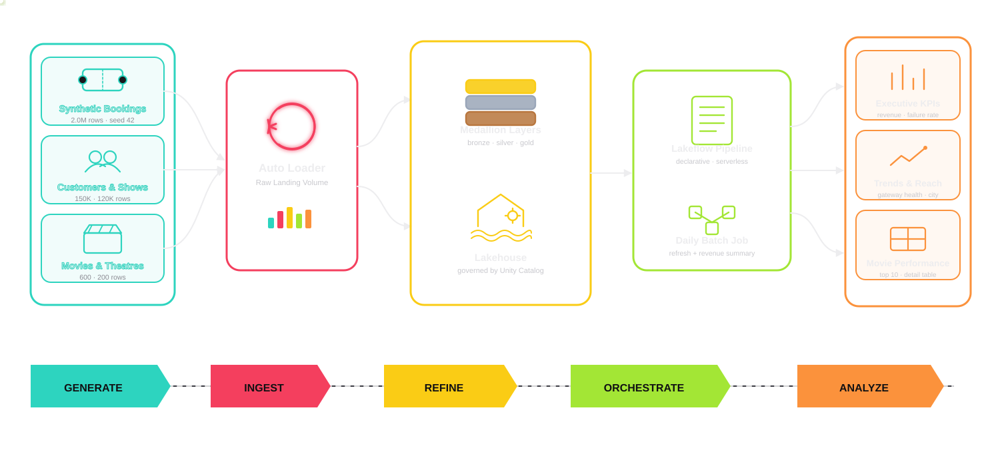

# BookMyShow Analytics

A medallion lakehouse for a movie-ticketing platform: synthetic booking data,
a bronze/silver/gold Lakeflow pipeline, a governed semantic model, and an
executive AI/BI dashboard -- all deployed as a single Databricks Asset Bundle.

**The story:** a blockbuster release drives a nationwide booking surge. Partway
through, a payment gateway outage hits **Mumbai and Delhi for a single day**,
spiking payment failures for the **PayFast** gateway from a ~3% baseline to
over 45% and denting that day's revenue -- a realistic incident the gold layer
and dashboard are built to surface and trace back to its root cause.

## Architecture



## Data model

| Layer | Schema | Tables |
|---|---|---|
| Raw | `raw` | Parquet files in the `landing_zone` volume: `theatres`, `movies`, `customers`, `shows`, `bookings` |
| Bronze | `bronze` | Same 5 entities, ingested via Auto Loader with `_ingested_at` / `_source_file` audit columns |
| Silver | `silver` | Same 5 entities, deduplicated, type-conformed, referential integrity enforced |
| Gold | `gold` | `dim_customers`, `dim_movies`, `dim_theatres`, `dim_shows`, `fact_bookings`, `agg_daily_revenue`, `agg_movie_performance`, `agg_theatre_occupancy`, `agg_payment_gateway_health`, `agg_city_revenue` |
| Semantic | `gold` | `bookings_metrics` -- a Unity Catalog Metric View over `fact_bookings` |

`fact_bookings` is denormalized with the dimensions analysts filter by most
(city, screen type, genre, blockbuster flag) so the dashboard and metric view
can slice without extra joins.

### Synthetic dataset size

~2,000,000 bookings, 120,000 shows, 150,000 customers, 600 movies, 200
theatres. Measured on the deployed dev catalog: ~81MB raw parquet + ~48MB
bronze + ~54MB silver + ~76MB gold Delta tables -- **~260MB total** across
the medallion, comfortably over the 200MB target.

## Semantic model & dashboard KPIs

`gold.bookings_metrics` (Unity Catalog Metric View, joined to `dim_customers`
for loyalty tier) defines the governed measures: Total Revenue, Total/Failed
Bookings, Payment Failure Rate, Avg Ticket Price, Cancellation Rate, Unique
Customers, Total Tickets Sold.

The **BookMyShow Executive Analytics** dashboard (built on top of gold) has:

- **KPIs**: Total Revenue, Total Bookings, Avg Ticket Price, Payment Failure Rate
- **Daily Revenue Trend** (line) -- the outage's revenue dip is visible here
- **Payment Failure Rate by Gateway** (line, colored by gateway) + a **Gateway x City** detail table -- pinpoints the PayFast/Mumbai/Delhi incident
- **Revenue by City** (bar), **Booking Channel Split** (pie), **Occupancy Rate by Screen Type** (bar)
- **Top 10 Movies by Revenue** (bar) + a full movie performance table
- Filters: booking date range, city, genre

## Project structure

```
databricks.yml                          # Bundle: bookmyshow_analytics (dev/prod targets)
resources/
  bookmyshow_medallion_pipeline.pipeline.yml
  bookmyshow_synthetic_data_job.job.yml # on-demand: (re)generates the raw dataset
  bookmyshow_daily_batch_job.job.yml    # scheduled: refreshes the pipeline daily
  liquid_clustering_demo.job.yml        # unrelated NYC-taxi liquid clustering benchmark (kept as-is)
src/
  bookmyshow_analytics/                 # shared, unit-tested pure Python
    business_rules.py                   # loyalty tiers, net amount, payment status, weighted picks
    main.py                             # daily revenue summary (python_wheel_task)
  bookmyshow_medallion_pipeline/
    transformations/{bronze,silver,gold}/
    semantic/bookings_metrics.sql       # metric view DDL (see below to deploy)
  bookmyshow_synthetic_data_generation.py  # Databricks-notebook-format generator
  dashboards/                           # deployed AI/BI dashboard definition
tests/
  unit/            # pure Python, no Spark -- uv run pytest tests/unit
  integration/      # Databricks Connect, needs a refreshed catalog -- uv run pytest tests/integration
```

## Getting started

Install [uv](https://docs.astral.sh/uv/getting-started/installation/), then:

```bash
uv sync --dev
```

Authenticate to the workspace (this project uses the `de-projects` CLI profile):

```bash
databricks auth login --host https://dbc-698fb84c-be59.cloud.databricks.com --profile de-projects
```

### Deploy and run

```bash
databricks bundle validate -t dev --profile de-projects
databricks bundle deploy -t dev --profile de-projects

# 1. (Re)generate the synthetic dataset (on-demand, ~2M rows)
databricks bundle run bookmyshow_synthetic_data_job -t dev --profile de-projects

# 2. Refresh the medallion pipeline
databricks bundle run bookmyshow_medallion_pipeline -t dev --profile de-projects
# after regenerating the raw dataset, use a full refresh instead so Auto Loader
# reprocesses the overwritten files:
databricks bundle run bookmyshow_medallion_pipeline -t dev --profile de-projects --full-refresh-all
```

Swap `-t dev` for `-t prod` to deploy to the isolated `bookmyshow_analytics_prod`
catalog (production mode pauses schedules until explicitly enabled).

### Deploying the semantic model

`src/bookmyshow_medallion_pipeline/semantic/bookings_metrics.sql` uses a
literal `__CATALOG__` placeholder (metric views aren't a native DAB resource
type, so this is deployed via CLI, not templated by the bundle). Use the
Statement Execution API directly -- `aitools statement submit --file` was
found to mangle this file's `$$ ... $$` YAML block during testing:

```bash
sed "s/__CATALOG__/bookmyshow_analytics_dev/g" \
  src/bookmyshow_medallion_pipeline/semantic/bookings_metrics.sql > /tmp/bookings_metrics.sql
python3 -c "
import json
payload = {'warehouse_id': '<WAREHOUSE_ID>', 'statement': open('/tmp/bookings_metrics.sql').read()}
json.dump(payload, open('/tmp/statement_payload.json', 'w'))
"
databricks api post /api/2.0/sql/statements/ --json @/tmp/statement_payload.json --profile de-projects
```

### Deploying the dashboard

The dashboard JSON lives at `src/dashboards/bookmyshow_executive_dashboard.lvdash.json`
and is deployed via the `bookmyshow_executive_dashboard` resource in
`resources/bookmyshow_executive_dashboard.dashboard.yml` -- `databricks bundle deploy`
creates/updates it automatically. Publish after any update:

```bash
databricks lakeview publish <DASHBOARD_ID> --warehouse-id <WAREHOUSE_ID> --profile de-projects
```

Find `<DASHBOARD_ID>` with `databricks bundle summary -t dev --profile de-projects -o json`
(`.resources.dashboards.bookmyshow_executive_dashboard.id`), or open it directly
from the workspace under **Workspace > Users > \<you\> > .bundle > bookmyshow_analytics > dev > resources**.

## Testing

```bash
uv run pytest tests/unit                 # pure Python, no Databricks connection needed
DATABRICKS_CONFIG_PROFILE=de-projects uv run pytest tests/integration   # needs a refreshed dev catalog
```

Integration tests validate gold-layer referential integrity, KPI reconciliation
between `fact_bookings` and `agg_daily_revenue`, and a regression check that the
payment-gateway outage story is still visible in `agg_payment_gateway_health`.

## Using AI tools during development

Data generation, pipeline output, and dashboard queries were all validated with
`databricks experimental aitools tools query` / `discover-schema` against the
`de-projects` profile before being wired into the bundle -- e.g. row counts and
referential integrity on the raw/bronze/silver/gold tables, and confirming the
outage-day failure-rate delta in `agg_payment_gateway_health` before building
the dashboard on top of it.
